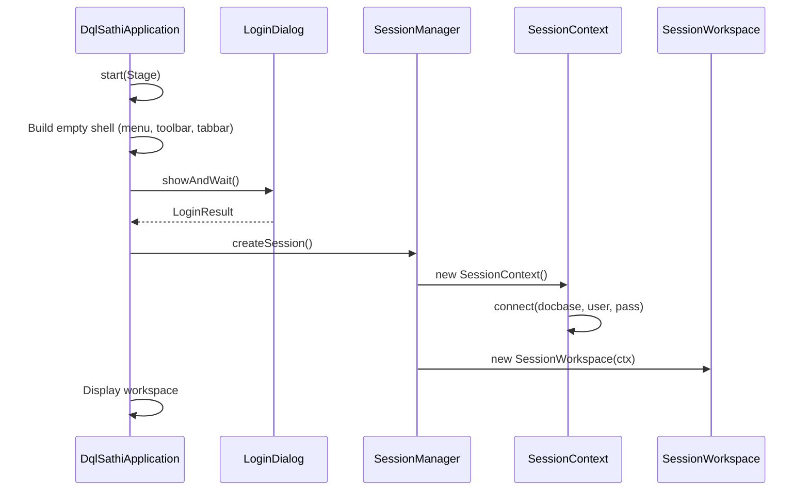
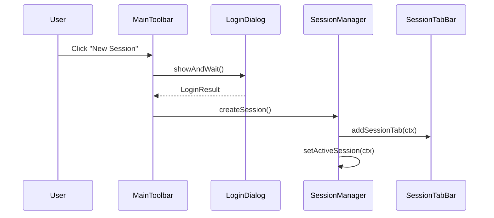

# Phase 1 Implementation Plan: Multi-Session Architecture

## Goal

Transform DQLSathi from single-connection to multi-session architecture with:
- Modal login dialog (frees screen space)
- Session tabs for multiple simultaneous connections
- Isolated state per session (DFC, cache, history, results)
- Modular design for future feature expansion

---

## User Requirements Confirmed

| Requirement | Decision |
|-------------|----------|
| Login UI | Modal dialog, opens on first launch |
| Session isolation | Completely isolated (DFC, cache, history) |
| Navigator | Collapsible, resizes editor/results when toggled |
| Priority | Multi-session tabs FIRST |
| Future modules | Architecture must support easy addition |

---

## Proposed Changes

### New Components

---

#### [NEW] [SessionContext.java](file:///d:/dqlSathi%20Devlopment/src/main/java/com/dqlsathi/model/SessionContext.java)

**Purpose**: Holds all state for one session (one repository connection).

```java
public class SessionContext {
    private final String sessionId;           // Unique identifier
    private final String connectionName;      // Display name: user@repository
    private DfcSession dfcSession;            // Isolated DFC connection
    private MetadataCache metadataCache;      // Isolated cache
    private List<String> queryHistory;        // Per-session history
    private SessionWorkspace workspace;       // UI container
    
    // Connection state
    public boolean isConnected();
    public void connect(String docbase, String user, String password);
    public void disconnect();
    
    // History
    public void addToHistory(String query);
    public List<String> getHistory();
}
```

---

#### [NEW] [SessionManager.java](file:///d:/dqlSathi%20Devlopment/src/main/java/com/dqlsathi/service/SessionManager.java)

**Purpose**: Singleton managing all sessions.

```java
public class SessionManager {
    private static SessionManager instance;
    private final List<SessionContext> sessions;
    private SessionContext activeSession;
    private final List<SessionChangeListener> listeners;
    
    public SessionContext createSession();           // Creates new empty session
    public void closeSession(SessionContext ctx);    // Closes and cleans up
    public void setActiveSession(SessionContext ctx);
    public SessionContext getActiveSession();
    public List<SessionContext> getAllSessions();
    
    // Event notification
    public void addSessionChangeListener(SessionChangeListener l);
    public interface SessionChangeListener {
        void onSessionAdded(SessionContext ctx);
        void onSessionRemoved(SessionContext ctx);
        void onActiveSessionChanged(SessionContext ctx);
    }
}
```

---

#### [NEW] [LoginDialog.java](file:///d:/dqlSathi%20Devlopment/src/main/java/com/dqlsathi/ui/LoginDialog.java)

**Purpose**: Modal dialog for entering credentials.

```java
public class LoginDialog extends Dialog<LoginResult> {
    private ComboBox<String> docbaseField;
    private TextField usernameField;
    private PasswordField passwordField;
    private Button historyButton;
    private CheckBox saveToHistoryCheckbox;
    
    public LoginDialog();
    
    // Returns LoginResult with credentials or null if cancelled
    public static Optional<LoginResult> showAndWait();
    
    // History dropdown (reuses existing ProfileManager)
    private void showHistoryDropdown();
    private void loadProfileToFields(ConnectionProfile profile);
}

public record LoginResult(String docbase, String username, String password, boolean saveToHistory) {}
```

**UI Layout** (like DQMan/DQLBuddy):
```
┌─────────────────────────────────────────┐
│  🔌 Documentum Login                  ✕ │
├─────────────────────────────────────────┤
│  Repository:  [▼ dropdown________] [⟳] │
│  Username:    [___________________]     │
│  Password:    [●●●●●●●●●●●________]     │
│                                         │
│  ☑ Save in login history               │
│                                         │
│  [History ▼]      [ Login ] [ Cancel ] │
└─────────────────────────────────────────┘
```

---

#### [NEW] [SessionTabBar.java](file:///d:/dqlSathi%20Devlopment/src/main/java/com/dqlsathi/ui/SessionTabBar.java)

**Purpose**: Horizontal tab bar showing all sessions.

```java
public class SessionTabBar extends HBox {
    private final SessionManager sessionManager;
    private final Map<SessionContext, SessionTab> tabMap;
    
    public SessionTabBar();
    
    private void addSessionTab(SessionContext ctx);
    private void removeSessionTab(SessionContext ctx);
    private void highlightActiveTab(SessionContext ctx);
    
    // Tab component
    private class SessionTab extends HBox {
        private Label icon;           // 🔌 or ⚠
        private Label connectionName; // user@repo
        private Button closeButton;   // ✕
    }
}
```

**Visual**:
```
[🔌 admin@EDMS ✕] [🔌 user@DEV ✕] [⚠ <not connected> ✕] [➕]
```

---

#### [NEW] [SessionWorkspace.java](file:///d:/dqlSathi%20Devlopment/src/main/java/com/dqlsathi/ui/SessionWorkspace.java)

**Purpose**: Container for one session's UI (editor + results).

```java
public class SessionWorkspace extends VBox {
    private final SessionContext context;
    private final QueryEditorPanel queryEditor;
    private final DumpTabPane resultPane;
    
    public SessionWorkspace(SessionContext context);
    
    public QueryEditorPanel getQueryEditor();
    public DumpTabPane getResultPane();
    
    // Binds UI to session context
    private void wireComponents();
}
```

---

#### [NEW] [MainToolbar.java](file:///d:/dqlSathi%20Devlopment/src/main/java/com/dqlsathi/ui/MainToolbar.java)

**Purpose**: Icon toolbar with common actions.

```java
public class MainToolbar extends ToolBar {
    private final SessionManager sessionManager;
    
    // Button groups
    private Button newSessionBtn;    // 🔌 New Session
    private Button disconnectBtn;    // ❌ Disconnect
    private Separator sep1;
    private Button runBtn;           // ▶ Run
    private Button stopBtn;          // ⏹ Stop
    private Separator sep2;
    private Button historyBtn;       // 📜 History
    private ToggleButton navigatorBtn; // 🗂 Navigator
    
    public MainToolbar(SessionManager sessionManager);
    
    // Actions
    private void handleNewSession();
    private void handleDisconnect();
    private void handleRun();
    private void handleStop();
    private void handleToggleNavigator();
}
```

---

#### [MODIFY] [MainMenuBar.java](file:///d:/dqlSathi%20Devlopment/src/main/java/com/dqlsathi/ui/MainMenuBar.java)

**Purpose**: Enhanced menu bar (refactored from `createMenuBar()` in DqlSathiApplication).

```java
public class MainMenuBar extends MenuBar {
    // Session Menu
    private Menu sessionMenu;     // New, History submenu, Disconnect, Close Tab, Exit
    
    // Edit Menu  
    private Menu editMenu;        // Undo, Redo, Cut, Copy, Paste, Find
    
    // Query Menu
    private Menu queryMenu;       // Execute, Cancel
    
    // View Menu
    private Menu viewMenu;        // Toggle Navigator, Zoom
    
    // Help Menu
    private Menu helpMenu;        // Logs, About
}
```

---

### Refactored Components

---

#### [MODIFY] [DfcService.java](file:///d:/dqlSathi%20Devlopment/src/main/java/com/dqlsathi/service/DfcService.java)

**Change**: From singleton to per-session instances.

```diff
- private static DfcService instance;
- public static DfcService getInstance() { ... }
+ // No longer singleton - instantiated per SessionContext
+ public DfcService() { ... }
```

Each `SessionContext` creates its own `DfcService` instance.

---

#### [MODIFY] [MetadataCache.java](file:///d:/dqlSathi%20Devlopment/src/main/java/com/dqlsathi/service/MetadataCache.java)

**Change**: From singleton to per-session instances.

```diff
- private static MetadataCache instance;
+ // Per-session instance, stored in SessionContext
```

---

#### [MODIFY] [DqlSathiApplication.java](file:///d:/dqlSathi%20Devlopment/src/main/java/com/dqlsathi/DqlSathiApplication.java)

**Major refactor**:

```diff
- private ConnectionPanel connectionPanel;
+ private MainMenuBar menuBar;
+ private MainToolbar toolbar;
+ private SessionTabBar sessionTabBar;
+ private StackPane workspaceContainer;  // Swaps SessionWorkspace per active session

  @Override
  public void start(Stage primaryStage) {
      // Layout: MenuBar → Toolbar → SessionTabBar → Workspace
+     showLoginDialogOnStartup();  // Modal on first launch
  }
```

---

### Application Flow

#### First Launch



#### Subsequent Session



---

## CSS Updates

New file: `src/main/resources/css/session-tabs.css`

```css
/* Session Tab Bar */
.session-tab-bar {
    -fx-background-color: #f5f5f5;
    -fx-padding: 4 8 4 8;
    -fx-spacing: 2;
}

.session-tab {
    -fx-background-color: #e0e0e0;
    -fx-background-radius: 4 4 0 0;
    -fx-padding: 6 12 6 12;
    -fx-cursor: hand;
}

.session-tab.active {
    -fx-background-color: white;
    -fx-border-color: #1976d2 transparent transparent transparent;
    -fx-border-width: 3 0 0 0;
}

.session-tab .close-button {
    -fx-background-color: transparent;
    -fx-padding: 0 0 0 8;
    -fx-opacity: 0.5;
}

.session-tab .close-button:hover {
    -fx-opacity: 1.0;
    -fx-text-fill: #d32f2f;
}

/* Main Toolbar */
.main-toolbar {
    -fx-background-color: #fafafa;
    -fx-padding: 4 8 4 8;
}

.main-toolbar .button {
    -fx-background-color: transparent;
    -fx-padding: 6 10 6 10;
}

.main-toolbar .button:hover {
    -fx-background-color: #e3f2fd;
    -fx-background-radius: 4;
}
```

---

## Verification Plan

### Manual Testing (Recommended)

Since this is a UI architecture change, manual testing is most appropriate:

#### Test 1: First Launch Shows Login Dialog
1. Run the application: `mvn javafx:run`
2. **Expected**: Modal login dialog appears immediately
3. **Verify**: Main window visible but disabled behind the dialog

#### Test 2: Successful Login Creates Session Tab
1. Enter valid credentials in login dialog
2. Click "Login"
3. **Expected**: 
   - Dialog closes
   - Session tab appears: `[🔌 username@repository ✕]`
   - Workspace shows query editor + results panel

#### Test 3: Multiple Sessions Work Independently
1. Click "New Session" button in toolbar
2. Login to a different repository (or same with different user)
3. **Expected**: Second tab appears
4. Execute query in Tab 1
5. Switch to Tab 2
6. **Expected**: Tab 2 shows its own empty editor/results (not Tab 1's data)

#### Test 4: Close Session Tab
1. With 2+ sessions open
2. Click ✕ on one session tab
3. **Expected**: 
   - Tab removed
   - If it was active, another tab becomes active
   - DFC session disconnected (check logs)

#### Test 5: Login History Works
1. Open login dialog
2. Click "History" dropdown
3. **Expected**: Previous logins appear (from existing profile storage)

### Automated Verification

Run existing tests to ensure no regressions:

```bash
cd "d:\dqlSathi Devlopment"
mvn test
```

---

## Risk Mitigation

| Risk | Mitigation |
|------|------------|
| DfcService singleton used elsewhere | Search for `DfcService.getInstance()` and update all call sites |
| MetadataCache singleton used elsewhere | Same - update all references |
| Existing tests depend on singletons | Update test setup to create instances |
| ConnectionPanel logic lost | Port all logic to LoginDialog |

---

## Files Changed Summary

| Action | File |
|--------|------|
| NEW | `src/main/java/com/dqlsathi/model/SessionContext.java` |
| NEW | `src/main/java/com/dqlsathi/service/SessionManager.java` |
| NEW | `src/main/java/com/dqlsathi/ui/LoginDialog.java` |
| NEW | `src/main/java/com/dqlsathi/ui/SessionTabBar.java` |
| NEW | `src/main/java/com/dqlsathi/ui/SessionWorkspace.java` |
| NEW | `src/main/java/com/dqlsathi/ui/MainToolbar.java` |
| NEW | `src/main/java/com/dqlsathi/ui/MainMenuBar.java` |
| NEW | `src/main/resources/css/session-tabs.css` |
| MODIFY | `src/main/java/com/dqlsathi/DqlSathiApplication.java` |
| MODIFY | `src/main/java/com/dqlsathi/service/DfcService.java` |
| MODIFY | `src/main/java/com/dqlsathi/service/MetadataCache.java` |
| DELETE | None (ConnectionPanel kept for reference, removed from layout) |

---

## Questions Before Implementation

> [!IMPORTANT]
> Please confirm before I proceed:

1. **Should the old `ConnectionPanel` be deleted entirely**, or kept temporarily for reference during migration?

2. **For the "New Session" workflow**: Should clicking the button open the login dialog immediately, or first create an empty "<not connected>" tab (like DQMan image 4)?

3. **Keyboard shortcut preferences**:
   - `Ctrl+N` for New Session?
   - `Ctrl+W` for Close Tab?
   - `F5` for Execute Query?

4. **What should happen if user closes the last session tab?** Options:
   - A) Exit the application
   - B) Show login dialog again
   - C) Keep empty workspace with "Connect to begin" message
