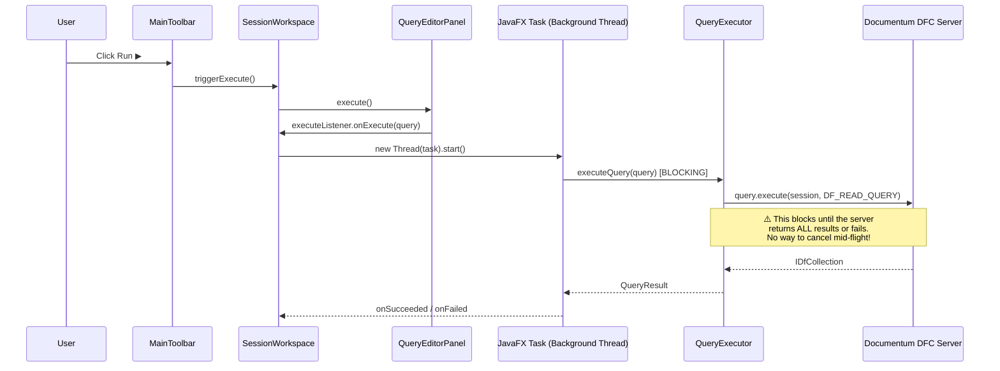
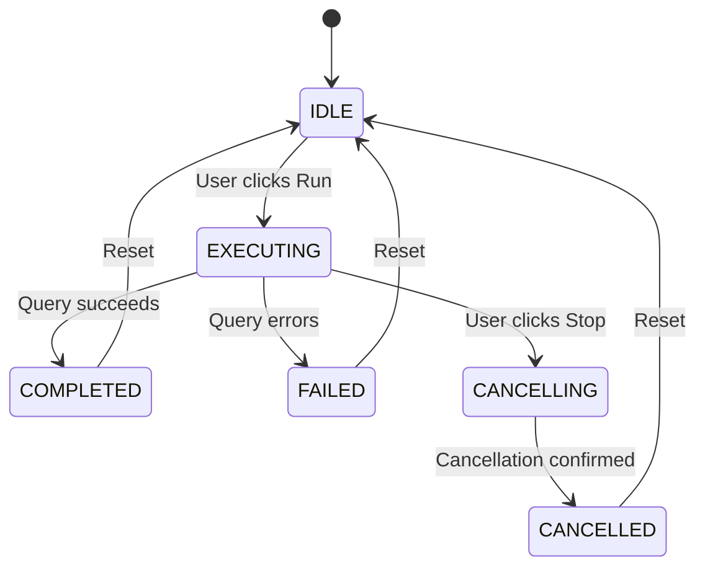

# Stop Button — Enterprise-Grade Implementation Analysis

## The Problem

The stop button is currently **dead code** — hardcoded to `disabled` with an empty `handleStop()` method. There is zero cancellation infrastructure in the entire query execution pipeline.

```java
// Current state in MainToolbar.java
stopButton.setDisable(true); // Hardcoded — never changes
private void handleStop() {
    // TODO: Cancel running query
    logger.debug("Stop requested");
}
```

---

## Deep Analysis: Current Query Execution Flow



### Key Findings

| Layer | File | Problem |
|-------|------|---------|
| **UI** | `MainToolbar.java` | Stop button always disabled, `handleStop()` is empty |
| **Orchestrator** | `SessionWorkspace.java` | `Task` reference is local — lost after method exits, no way to cancel |
| **Executor** | `QueryExecutor.java` | Synchronous, no `volatile` cancel flag, no `Thread.interrupt()` support |
| **DFC** | `DfcService.java` | No session-level cancel. DFC's `IDfCollection.close()` can force-terminate iteration |

---

## The Enterprise Approach: What Needs to Change

### Architecture: Event-Driven Query Lifecycle

The core idea is a **Query Lifecycle State Machine** that drives all UI state changes:



Every state transition triggers **button state updates** automatically via a listener/callback pattern.

### Feature Set

| Feature | Description |
|---------|-------------|
| **🔴 Query Cancellation** | Interrupt the running query via `Task.cancel()` + `Thread.interrupt()` + DFC collection close |
| **🔄 Button State Machine** | Stop button reactively enables/disables based on query lifecycle state |
| **📊 Status Bar Feedback** | Real-time status: "Executing...", "Cancelling...", "Cancelled", "Completed" |
| **⏱️ Elapsed Timer** | Show live elapsed time during execution (e.g., "Executing... 3.2s") |
| **🔒 Thread Safety** | `volatile` flags + `AtomicReference` for safe cross-thread cancellation |
| **🛡️ DFC Resource Cleanup** | Guaranteed session/collection cleanup on cancel via `finally` blocks |
| **📝 Keyboard Shortcut** | `Ctrl+Break` or `Escape` to cancel from keyboard |
| **🎯 Per-Session Isolation** | Each session tracks its own running task independently |
| **🚫 Prevent Double-Submit** | Run button disables during execution — prevents duplicate queries |

---

## Proposed Changes

### Component 1: Query Lifecycle Model

#### [NEW] [QueryExecutionState.java](file:///d:/dqlSathi%20Devlopment/src/main/java/com/dqlsathi/model/QueryExecutionState.java)

Enum defining the lifecycle states: `IDLE`, `EXECUTING`, `CANCELLING`, `COMPLETED`, `FAILED`, `CANCELLED`.

---

### Component 2: Cancellable Query Executor

#### [MODIFY] [QueryExecutor.java](file:///d:/dqlSathi%20Devlopment/src/main/java/com/dqlsathi/service/QueryExecutor.java)

- Add `volatile boolean cancelled` flag
- Add `requestCancel()` method that sets flag + closes active `IDfCollection`
- Check `cancelled` flag inside the `parseResults()` row-iteration loop
- Store `IDfCollection` reference as instance field for external cancellation
- Ensure `finally` block always releases session + closes collection

---

### Component 3: Session Workspace — Task Lifecycle Owner

#### [MODIFY] [SessionWorkspace.java](file:///d:/dqlSathi%20Devlopment/src/main/java/com/dqlsathi/ui/SessionWorkspace.java)

- Store `Task<QueryResult>` as instance field `currentTask`
- Store `QueryExecutor` as instance field `currentExecutor`
- Add `cancelQuery()` public method:
  1. Call `currentExecutor.requestCancel()`
  2. Call `currentTask.cancel(true)` — sends `Thread.interrupt()`
- Add `QueryExecutionState` tracking with listener callback
- Fire state change events: `IDLE → EXECUTING → COMPLETED/FAILED/CANCELLED`
- Add `setOnQueryStateChanged(Consumer<QueryExecutionState> listener)` callback
- Disable Run button (`EXECUTING` state) to prevent double-submit

---

### Component 4: Toolbar Integration

#### [MODIFY] [MainToolbar.java](file:///d:/dqlSathi%20Devlopment/src/main/java/com/dqlsathi/ui/MainToolbar.java)

- Subscribe to active session's `QueryExecutionState` changes
- `updateButtonStates()` now also manages stop button:
  - `IDLE` → Stop **disabled**, Run **enabled**
  - `EXECUTING` → Stop **enabled**, Run **disabled**
  - `CANCELLING/CANCELLED/COMPLETED/FAILED` → Stop **disabled**, Run **enabled**
- `handleStop()` calls `activeWorkspace.cancelQuery()`
- Cleanup: unsubscribe from old session's listener when switching sessions

---

### Component 5: Status Bar Enhancement

#### [MODIFY] [QueryEditorPanel.java](file:///d:/dqlSathi%20Devlopment/src/main/java/com/dqlsathi/ui/QueryEditorPanel.java)

- Update `setQueryStatus()` to show state-aware messages:
  - `EXECUTING` → "⏳ Executing query..."
  - `CANCELLING` → "🛑 Cancelling..."
  - `CANCELLED` → "⚠️ Query cancelled by user"
  - `COMPLETED` → "✅ Query executed — N rows in X.Xs"

---

## Button State Matrix (Complete)

| State | Run ▶ | Stop ⏹ | Clear 🗑 | Disconnect | History |
|-------|-------|--------|----------|------------|---------|
| No session | ❌ | ❌ | per-text | ❌ | ❌ |
| Connected, IDLE | per-text | ❌ | per-text | ✅ | ✅ |
| Connected, EXECUTING | ❌ | ✅ | per-text | ❌ | ✅ |
| Connected, CANCELLING | ❌ | ❌ | per-text | ❌ | ✅ |

> `per-text` = enabled only if editor has text content

---

## DFC Cancellation Strategy

> [!IMPORTANT]
> DFC (Documentum Foundation Classes) does NOT support `IDfQuery.cancel()`. The server-side query runs to completion. What we CAN do is **stop reading results client-side**.

**Three-layer cancellation:**

1. **`Task.cancel(true)`** — sends `Thread.interrupt()` to the background thread
2. **`volatile cancelled` flag** — checked in the row-iteration loop in `parseResults()`
3. **`IDfCollection.close()`** — force-closes the result cursor, stops network reads

This means:
- For fast queries (< 1s): Cancel may arrive after completion — harmless
- For large result sets: Cancel stops iteration — returns partial results or cancellation error
- For slow server queries: The server still runs, but the client thread is freed immediately

---

## Verification Plan

### Manual Verification

Since this is a JavaFX UI application with DFC dependencies (requires a live Documentum repository), verification is manual:

1. **Start application** → Verify stop button is **disabled** by default
2. **Connect to repository** → Verify stop button remains **disabled** (no query running)
3. **Execute a fast query** (e.g., `select r_object_id from dm_cabinet`) → Verify:
   - Stop button briefly enables during execution
   - Stop button disables after results appear
   - Run button disables during execution, re-enables after
4. **Execute a slow/large query** (e.g., `select * from dm_sysobject`) → Click Stop:
   - Verify stop button enables when query starts
   - Verify clicking Stop shows "Cancelling..." in status bar
   - Verify status bar shows "Query cancelled by user"
   - Verify stop button disables after cancellation
   - Verify Run button re-enables after cancellation
5. **Switch sessions** during execution → Verify button states reflect the active session's state
6. **Disconnect during execution** → Verify graceful cleanup, no dangling threads

> [!TIP]
> You can suggest additional manual test scenarios or any queries you typically use for testing long-running operations.
