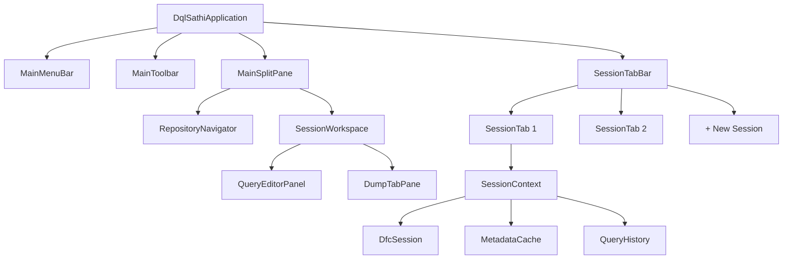
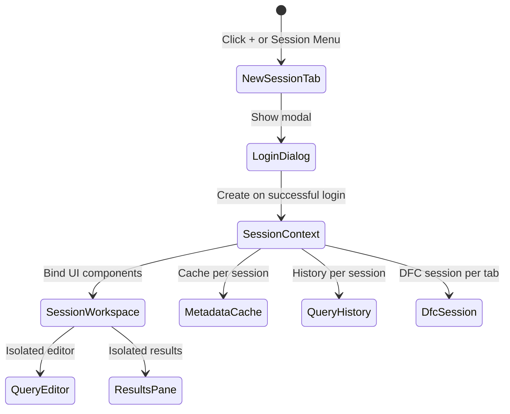

# DQLSathi UI Architecture Analysis

## Executive Summary

This analysis provides a strategic UI architecture plan for DQLSathi to evolve from a simple query tool into an enterprise-grade Documentum platform comparable to DQMan and DQLBuddy. The goal is to design a flexible, extensible UI foundation that can accommodate:

- **Multiple simultaneous repository connections**
- **Modular feature expansion** (DQL, API, Scripts, Jobs, Object Browser)
- **Future integration** with SiteAnalyser and other tools

---

## Current State Analysis

### Existing Architecture

````carousel
| Component | Purpose | Lines of Code |
|-----------|---------|---------------|
| `DqlSathiApplication.java` | Main app, layout, wiring | ~340 |
| `ConnectionPanel.java` | Login form with history | ~580 |
| `QueryEditorPanel.java` | DQL editor with syntax highlighting | ~627 |
| `ResultsPanel.java` | Results table with filtering | ~1547 |
| `DumpTabPane.java` | Result tabs + dump tabs | ~147 |
| `DumpPanel.java` | Object attribute viewer | ~200 |
<!-- slide -->
### Current UI Layout

```
┌────────────────────────────────────────────────────────────┐
│ MenuBar (Help only)                                        │
├────────────────────────────────────────────────────────────┤
│ ConnectionPanel (Username, Password, Repository, Buttons) │
├────────────────────────────────────────────────────────────┤
│ QueryEditorPanel (Code Editor + Execute/Clear)             │
├────────────────────────────────────────────────────────────┤
│ DumpTabPane                                                │
│   ├─ Results Tab (ResultsPanel)                           │
│   └─ Dump: [objectId] Tab(s) (DumpPanel)                  │
└────────────────────────────────────────────────────────────┘
```
<!-- slide -->
### Strengths
- ✅ Clean separation of concerns (panels are modular)
- ✅ Login history already implemented
- ✅ DumpTabPane already supports dynamic tabs
- ✅ Modern JavaFX with syntax highlighting
- ✅ CSS-based styling in place

### Limitations
- ❌ Single connection only - no multi-repository support
- ❌ No icon toolbar - everything is text-based
- ❌ No repository navigator sidebar
- ❌ Menu bar is minimal (Help only)
- ❌ No session management for multiple connections
- ❌ Tight coupling in `DqlSathiApplication` for panel wiring
````

---

## DQMan Reference Analysis

### DQMan UI Structure (from screenshots)

)

)

### Three-Tier Menu Structure

```
┌──────────────────────────────────────────────────────────────────────────┐
│ ROW 1: Global Text Menu                                                  │
│ Session │ Jobs │ Edit │ View │ Functions │ Favorites │ Extras │ Windows │ Help │
├──────────────────────────────────────────────────────────────────────────┤
│ ROW 2: Icon Toolbar                                                      │
│ 🔌Session │ 📋Jobs │ 📄Copy │ ❌Disconnect │ 📝DQL │ 🔧API │ ... │ ▶Run │ ⏸Pause │ ⏹Stop │
├──────────────────────────────────────────────────────────────────────────┤
│ ROW 3: Connection Tabs (Dynamic)                                         │
│ [🔌 user@REPO1 ✕] │ [🔌 user@REPO2 ✕] │ [⚠ <not connected> ✕] │ ...    │
└──────────────────────────────────────────────────────────────────────────┘
```

### Key DQMan Features to Adopt

| Feature | DQMan Implementation | Priority for DQLSathi |
|---------|---------------------|----------------------|
| **Multi-Connection Tabs** | 3rd row tabs, each with own session | 🔴 Critical |
| **Session Dropdown** | Click Session icon → history list | 🔴 Critical |
| **Icon Toolbar** | Visual shortcuts for common actions | 🟠 High |
| **Repository Navigator** | Tree view: Folders/Types/Groups/Users | 🟠 High |
| **DQL/API/Script Modes** | Different execution modes per tab | 🟡 Medium |
| **History Panel** | Browse and re-execute past queries | 🟡 Medium |
| **Favorites** | Save frequently used queries | 🟢 Nice to have |

---

## Proposed UI Architecture

### Target Layout

```
┌──────────────────────────────────────────────────────────────────────────┐
│ ROW 1: Global Menu Bar                                                   │
│ [Session] [Edit] [View] [Query] [Tools] [Windows] [Help]                │
├──────────────────────────────────────────────────────────────────────────┤
│ ROW 2: Main Toolbar (Icons + Labels)                                     │
│ [🔌New] [📋Jobs] [📄Copy] [❌Disconnect] ║ [📝DQL] [🔧API] [📜Script] ║ [▶Run] [⏹Stop] ║ [📜History] [⭐Fav] │
├──────────────────────────────────────────────────────────────────────────┤
│ ROW 3: Session Tab Bar                                                   │
│ [🔌 admin@EDMS ✕] [⚠ <not connected>] [➕]                              │
├───────────────────────┬──────────────────────────────────────────────────┤
│ Repository Navigator  │ Active Session Workspace                        │
│ ┌─────────────────┐  │ ┌──────────────────────────────────────────────┐ │
│ │ 📁 Folders      │  │ │ Query Editor (with mode indicator)           │ │
│ │ 📋 Types        │  │ ├──────────────────────────────────────────────┤ │
│ │ 👥 Groups       │  │ │ [Results] [Dump: 09...] [Dump: 08...]       │ │
│ │ 👤 Users        │  │ │ ┌──────────────────────────────────────────┐ │ │
│ └─────────────────┘  │ │ │ Results Table / Dump Panel               │ │ │
│ [Filter: 🔍______]   │ │ └──────────────────────────────────────────┘ │ │
│                      │ └──────────────────────────────────────────────┘ │
├───────────────────────┴──────────────────────────────────────────────────┤
│ Status Bar: [Connection Status] [Row Count] [Execution Time]            │
└──────────────────────────────────────────────────────────────────────────┘
```

### Component Hierarchy



---

## Implementation Strategy

### Phase 1: Core Session Architecture (Foundation)

> [!IMPORTANT]
> This is the **critical foundation** that must be built first. All other features depend on proper session isolation.

#### New Components

| Component | Responsibility |
|-----------|---------------|
| `SessionContext` | Holds session state: connection, cache, history, results |
| `SessionTabBar` | Manages session tabs (add, close, switch) |
| `SessionWorkspace` | Container for per-session UI (editor + results) |
| `SessionManager` | Singleton coordinating all sessions |

#### Refactoring Required

1. **Decouple `DfcService`** from singleton → per-session instances
2. **Move connection logic** from `ConnectionPanel` → modal `LoginDialog`
3. **Isolate state** per session (query history, results, metadata cache)

---

### Phase 2: Main Toolbar (Visual Shortcuts)

```java
// Proposed toolbar structure
MainToolbar
├── SessionGroup: [New Session ▼] [Disconnect]
├── Separator
├── ModeGroup: [DQL] [API] [DQL Script] [API Script]
├── Separator  
├── ExecutionGroup: [Run ▶] [Step] [Pause ‖] [Stop ■]
├── Separator
└── HistoryGroup: [History] [Favorites] [Navigator]
```

---

### Phase 3: Repository Navigator (Sidebar)

```java
RepositoryNavigator extends TreeView<NavigatorNode>
├── Folders (dm_folder hierarchy)
├── Types (dm_type, expandable to subtypes)
├── Groups (dm_group list)
├── Users (dm_user list)
└── Registered Tables
```

**Key behaviors:**
- Double-click Type → insert `select * from type_name` in editor
- Drag folder → insert folder path
- Context menu → view properties, create query template

---

### Phase 4: Enhanced Menu Bar

```
Session Menu:
  - New Connection... (Ctrl+N)
  - Connect (from history submenu)
  - Disconnect (Ctrl+D)
  - Close Tab (Ctrl+W)
  - Exit

Edit Menu:
  - Undo/Redo
  - Cut/Copy/Paste
  - Find/Replace (Ctrl+F)
  - Format Query

Query Menu:
  - Execute (F5)
  - Execute Selected (Ctrl+Enter)
  - Explain Plan
  - Cancel Query (Esc)

View Menu:
  - Toggle Navigator (Ctrl+1)
  - Toggle History (Ctrl+2)
  - Zoom In/Out
  - Reset Layout

Tools Menu:
  - Object Dump (Alt+D)
  - DQL Script Runner
  - API Script Runner
  - Batch Export
  
Windows Menu:
  - [List of open session tabs]
  
Help Menu:
  - Documentation
  - Open Logs Folder
  - About
```

---

## Data Flow Architecture

### Per-Session State Isolation



### Event Flow

```java
// User executes query in Session Tab 2
SessionTabBar.activeSession = session2;
session2.workspace.queryEditor.execute()
    → session2.context.dfcSession.executeQuery(dql)
    → session2.workspace.resultsPanel.displayResults()
    → session2.context.queryHistory.addEntry(dql)
```

---

## File Structure Proposal

```
src/main/java/com/dqlsathi/
├── DqlSathiApplication.java          # Slimmed down, just bootstrapping
├── config/
├── export/
├── filter/
├── highlight/
├── model/
│   ├── SessionContext.java           # NEW: Per-session state container
│   ├── NavigatorNode.java            # NEW: Tree node for navigator
│   └── ...existing models...
├── service/
│   ├── SessionManager.java           # NEW: Coordinates multiple sessions
│   └── ...existing services...
├── ui/
│   ├── MainMenuBar.java              # NEW: Enhanced menu bar
│   ├── MainToolbar.java              # NEW: Icon toolbar
│   ├── SessionTabBar.java            # NEW: Connection tabs
│   ├── SessionWorkspace.java         # NEW: Per-session container
│   ├── LoginDialog.java              # NEW: Modal login (refactored from ConnectionPanel)
│   ├── RepositoryNavigator.java      # NEW: Tree sidebar
│   ├── QueryEditorPanel.java         # EXISTING: Minor updates
│   ├── ResultsPanel.java             # EXISTING: Minor updates
│   ├── DumpTabPane.java              # EXISTING: Minor updates
│   └── ...
└── util/
```

---

## Migration Path

### Backward Compatibility

The transition should be **non-breaking**:

1. **Phase 1**: Add new session infrastructure alongside existing code
2. **Phase 2**: Keep single-session mode as default, multi-session as opt-in
3. **Phase 3**: Once stable, make multi-session the default

### Incremental Delivery

| Sprint | Deliverable | Risk |
|--------|-------------|------|
| 1 | Session architecture (SessionContext, SessionManager) | Low |
| 2 | SessionTabBar + LoginDialog modal | Low |
| 3 | Toolbar with basic actions | Low |
| 4 | Repository Navigator (Types only) | Medium |
| 5 | Full Navigator + History panel | Medium |
| 6 | Script execution modes | Medium |
| 7 | SiteAnalyser integration hooks | High |

---

## Design Decisions & Trade-offs

### Decision 1: Modal Login vs Inline Panel

**Chosen: Modal Dialog (like DQMan)**

| Approach | Pros | Cons |
|----------|------|------|
| **Modal Dialog** | Cleaner main UI, less clutter, standard UX | Extra click to access |
| Current Inline Panel | Always visible, quick access | Takes permanent screen space |

### Decision 2: Session Tab Architecture

**Chosen: New Tab = New Session (like DQMan)**

Each session tab gets:
- Own DFC session
- Own metadata cache
- Own query history
- Own results/dump tabs

**Alternative rejected**: Shared session with multiple query tabs (less intuitive)

### Decision 3: Navigator Position

**Chosen: Left sidebar, collapsible**

- Left aligns with file browser conventions (Explorer, VS Code)
- Collapsible saves space for query editing
- Toggle via View menu or Ctrl+1

---

## Questions for User Clarification

Before proceeding with implementation, please confirm:

1. **Priority**: Should we implement **multi-connection tabs first** (core session work) or would you prefer **toolbar/menu enhancements first** (more visible but less foundational)?

2. **Repository Navigator scope**: Which items are essential for V1?
   - [ ] Folders (dm_folder tree)
   - [ ] Types (dm_type, including custom types)
   - [ ] Groups (dm_group)
   - [ ] Users (dm_user)
   - [ ] Registered Tables

3. **Script execution**: Do you need **DQL Script** (batch execution) and **API Script** modes soon, or can these wait for a later phase?

4. **SiteAnalyser integration**: Any specific hooks or data exchange patterns we should design for now?

5. **Would you like to share DQLBuddy screenshots** for additional reference, or is DQMan sufficient as the primary reference?

---

## Next Steps (Pending Approval)

If this analysis is approved, I will create a detailed `implementation_plan.md` for **Phase 1: Session Architecture** including:

- Exact file changes
- New class designs with method signatures
- CSS updates for new components
- Testing strategy


