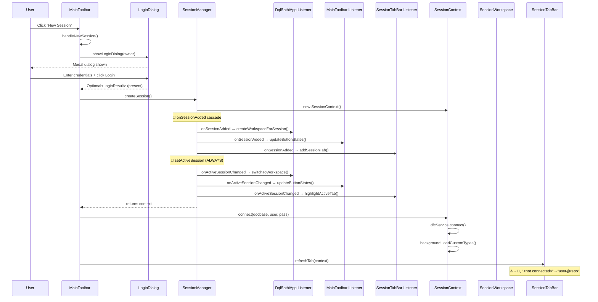
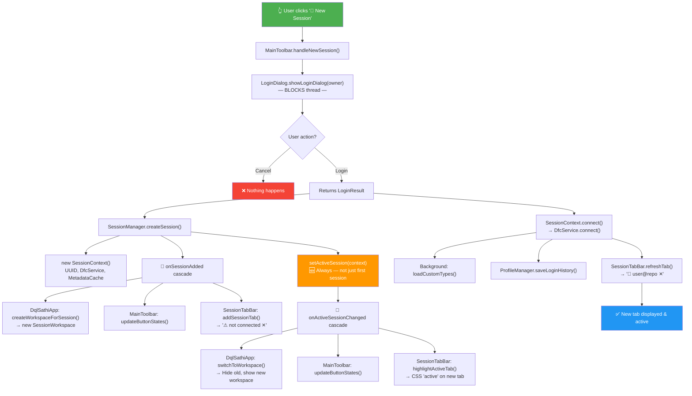
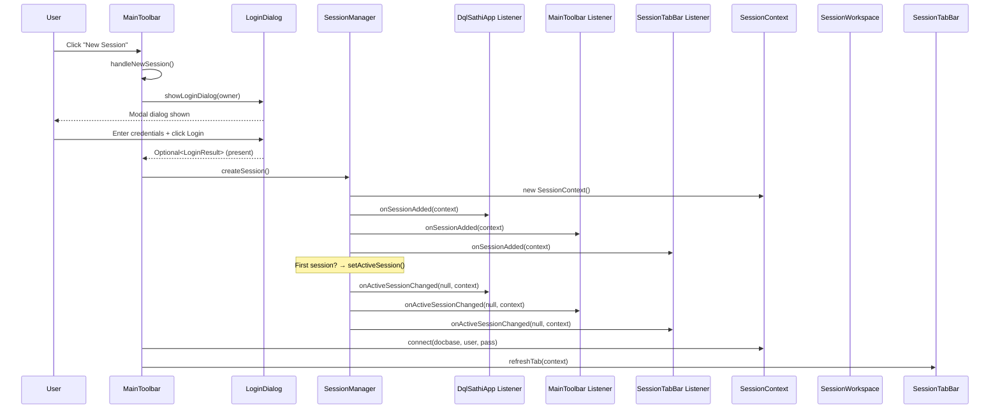
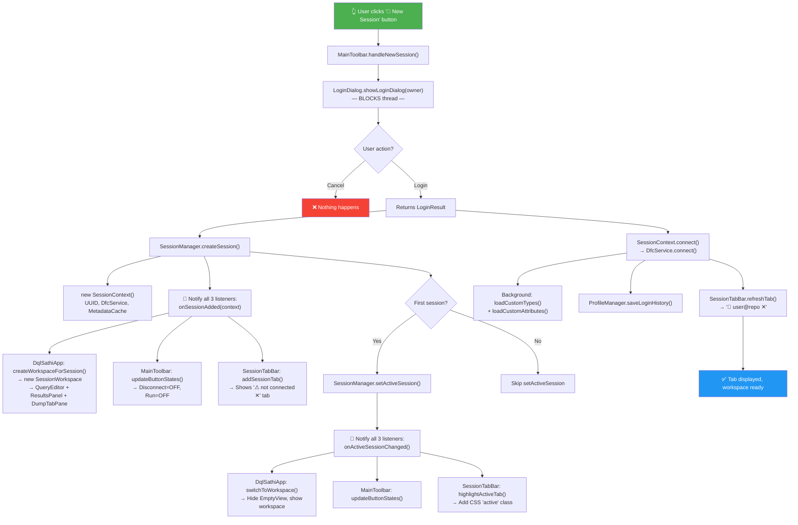

# 🔌 New Session Button — Complete End-to-End Flow


This traces **every method call, listener notification, and button state change** from the moment the user clicks "🔌 New Session" on the toolbar until the new tab is fully displayed and active.

---

## Streamlined Fix: `setActiveSession` Centralized

> [!IMPORTANT]
> We discovered that `MainToolbar.handleNewSession()` was missing `sessionManager.setActiveSession(context)`, causing newly created sessions from the toolbar to not display. Instead of patching each caller, we centralized this into `SessionManager.createSession()`.

### Changes Made

#### [SessionManager.java](file:///d:/dqlSathi%20Devlopment/src/main/java/com/dqlsathi/service/SessionManager.java) — Line 68-71
```diff
-        // If this is the first session, make it active
-        if (sessions.size() == 1) {
-            setActiveSession(context);
-        }
+        // Always activate the newly created session
+        setActiveSession(context);
```

#### [DqlSathiApplication.java](file:///d:/dqlSathi%20Devlopment/src/main/java/com/dqlsathi/DqlSathiApplication.java) — Line 262-263
```diff
                 sessionTabBar.refreshTab(context);
                 updateWindowTitle(context);
-                //set the new tab active
-                sessionManager.setActiveSession(context); 
                 logger.info("Connected to {}@{}", login.getUsername(), login.getDocbase());
```

**`MainToolbar.handleNewSession()`** — No change needed (centralized fix covers it).

---

## 1. Startup: Listeners Registered During Initialization

Before any click happens, `DqlSathiApplication.start()` wires up **3 listeners**. These are dormant callbacks — they fire later when sessions are created/changed.

| # | Where Registered | Listener | Callbacks |
|---|---|---|---|
| 1 | [DqlSathiApplication.java:97-115](file:///d:/dqlSathi%20Devlopment/src/main/java/com/dqlsathi/DqlSathiApplication.java#L97-L115) | Anonymous `SessionChangeListener` | `onSessionAdded` → `createWorkspaceForSession()` · `onSessionRemoved` → `removeWorkspaceForSession()` · `onActiveSessionChanged` → `switchToWorkspace()` |
| 2 | [MainToolbar.java:59-74](file:///d:/dqlSathi%20Devlopment/src/main/java/com/dqlsathi/ui/MainToolbar.java#L59-L74) | Anonymous `SessionChangeListener` | All 3 callbacks → `updateButtonStates()` |
| 3 | [SessionTabBar.java:65](file:///d:/dqlSathi%20Devlopment/src/main/java/com/dqlsathi/ui/SessionTabBar.java#L65) | `SessionTabBar` itself (implements interface) | `onSessionAdded` → `addSessionTab()` · `onSessionRemoved` → `removeSessionTab()` · `onActiveSessionChanged` → `highlightActiveTab()` |

---

## 2. User Clicks "🔌 New Session" — Sequence Diagram



---

## 3. Step-by-Step Call Stack

### Step 3.1 — Button Click → Login Dialog

| # | Class | Method | Line | What Happens |
|---|---|---|---|---|
| 1 | `MainToolbar` | [handleNewSession()](file:///d:/dqlSathi%20Devlopment/src/main/java/com/dqlsathi/ui/MainToolbar.java#L150-L190) | 150 | Gets owner window from `getScene().getWindow()` |
| 2 | `LoginDialog` | [showLoginDialog(owner)](file:///d:/dqlSathi%20Devlopment/src/main/java/com/dqlsathi/ui/LoginDialog.java#L342-L348) | 342 | Creates `LoginDialog`, calls `showAndWait()` — **blocks thread** |
| 3 | `LoginDialog` | [constructor](file:///d:/dqlSathi%20Devlopment/src/main/java/com/dqlsathi/ui/LoginDialog.java#L54-L191) | 54 | Builds form: Repository ComboBox, Username, Password, Save checkbox. Login button **disabled** by default — enabled via text-change listeners when all fields filled |
| 4 | `LoginDialog` | [loadAvailableDocbases()](file:///d:/dqlSathi%20Devlopment/src/main/java/com/dqlsathi/ui/LoginDialog.java#L270-L304) | 270 | Background thread discovers docbases from DocBroker |

### Step 3.2 — User Clicks Login → `createSession()` + Listener Cascade

| # | Class | Method | Line | What Happens |
|---|---|---|---|---|
| 5 | `SessionManager` | [createSession()](file:///d:/dqlSathi%20Devlopment/src/main/java/com/dqlsathi/service/SessionManager.java#L57-L74) | 57 | Creates `new SessionContext()`, adds to list |
| 6 | `SessionContext` | [constructor](file:///d:/dqlSathi%20Devlopment/src/main/java/com/dqlsathi/model/SessionContext.java#L42-L55) | 42 | UUID, name=`<not connected>`, creates isolated `DfcService`, `MetadataCache`, `MetadataService` |

#### 🔔 First Cascade: `onSessionAdded(context)` — [SessionManager.java:64-66](file:///d:/dqlSathi%20Devlopment/src/main/java/com/dqlsathi/service/SessionManager.java#L64-L66)

| Listener | Method Called | Effect |
|---|---|---|
| **DqlSathiApp** | [createWorkspaceForSession()](file:///d:/dqlSathi%20Devlopment/src/main/java/com/dqlsathi/DqlSathiApplication.java#L279-L291) | Creates `SessionWorkspace` (QueryEditor + ResultsPanel + DumpTabPane), wires `onTextChanged` → `toolbar.updateButtonStates(hasText)` |
| **MainToolbar** | [updateButtonStates()](file:///d:/dqlSathi%20Devlopment/src/main/java/com/dqlsathi/ui/MainToolbar.java#L260-L262) | Disconnect=OFF, Run=OFF, Clear=OFF, History=OFF |
| **SessionTabBar** | [addSessionTab()](file:///d:/dqlSathi%20Devlopment/src/main/java/com/dqlsathi/ui/SessionTabBar.java#L85-L98) | Creates tab showing `⚠ <not connected> ✕`, inserts before ➕ button |

#### 🔔 Second Cascade: `setActiveSession(context)` — [SessionManager.java:68](file:///d:/dqlSathi%20Devlopment/src/main/java/com/dqlsathi/service/SessionManager.java#L68) (now fires for ALL sessions, not just first)

| Listener | Method Called | Effect |
|---|---|---|
| **DqlSathiApp** | [switchToWorkspace()](file:///d:/dqlSathi%20Devlopment/src/main/java/com/dqlsathi/DqlSathiApplication.java#L308-L350) | Hides EmptyView, sets `DqlAutoCompleter.setMetadataService()`, shows new workspace via `setVisible(true)` + `toFront()`, updates window title |
| **MainToolbar** | [updateButtonStates()](file:///d:/dqlSathi%20Devlopment/src/main/java/com/dqlsathi/ui/MainToolbar.java#L260-L262) | Re-evaluates (still not connected) |
| **SessionTabBar** | [highlightActiveTab()](file:///d:/dqlSathi%20Devlopment/src/main/java/com/dqlsathi/ui/SessionTabBar.java#L114-L123) | Adds CSS `active` to new tab, removes from old |

### Step 3.3 — Connection + Tab Refresh

| # | Class | Method | Line | What Happens |
|---|---|---|---|---|
| 7 | `SessionContext` | [connect()](file:///d:/dqlSathi%20Devlopment/src/main/java/com/dqlsathi/model/SessionContext.java#L66-L92) | 66 | `dfcService.connect()`, sets name to `user@repo`, background thread loads custom types + attributes |
| 8 | `ProfileManager` | `saveLoginHistory()` | — | Saves credentials to history file |
| 9 | `SessionTabBar` | [refreshTab()](file:///d:/dqlSathi%20Devlopment/src/main/java/com/dqlsathi/ui/SessionTabBar.java#L129-L134) | 129 | `tab.updateDisplay()`: icon `⚠`→`🔌`, name `<not connected>`→`user@repo` |

---

## 4. Visual Flow Diagram



---

## 5. Button States at Each Phase

| Button | Before Login | After `createSession()` | After `connect()` | After user types text |
|---|---|---|---|---|
| **New Session** | ✅ Enabled | ✅ Enabled | ✅ Enabled | ✅ Enabled |
| **Disconnect** | ❌ Disabled | ❌ Disabled | ✅ Enabled | ✅ Enabled |
| **Run** | ❌ Disabled | ❌ Disabled | ❌ Disabled | ✅ Enabled |
| **Stop** | ❌ Disabled | ❌ Disabled | ❌ Disabled | ❌ Disabled |
| **Clear** | ❌ Disabled | ❌ Disabled | ❌ Disabled | ✅ Enabled |
| **History** | ❌ Disabled | ❌ Disabled | ✅ Enabled | ✅ Enabled |
| **Navigator** | ✅ Enabled | ✅ Enabled | ✅ Enabled | ✅ Enabled |

> [!NOTE]
> **Run** and **Clear** only enable when user types text — driven by `onTextChanged` callback wired in [DqlSathiApplication.java:287-289](file:///d:/dqlSathi%20Devlopment/src/main/java/com/dqlsathi/DqlSathiApplication.java#L287-L289).

---

## 6. Full Chronological Call Stack

```
1.  User CLICK → newSessionButton.onAction
2.  ├── MainToolbar.handleNewSession()                    ← entry point
3.  │   ├── getScene().getWindow()
4.  │   ├── LoginDialog.showLoginDialog(owner)            ← BLOCKS
5.  │   │   ├── new LoginDialog()
6.  │   │   │   ├── ProfileManager.getInstance()
7.  │   │   │   ├── loadAvailableDocbases() → background
8.  │   │   │   │   └── DfClient.getLocalClient().getDocbaseMap()
9.  │   │   │   └── validateFields listener on 3 fields
10. │   │   └── dialog.showAndWait()                      ← MODAL
11. │   │
12. │   │   [User fills form, clicks Login → returns LoginResult]
13. │   │
14. │   ├── SessionManager.createSession()
15. │   │   ├── new SessionContext()
16. │   │   │   ├── UUID.randomUUID()
17. │   │   │   ├── new DfcService()
18. │   │   │   ├── new MetadataCache()
19. │   │   │   └── new MetadataService(cache)
20. │   │   ├── sessions.add(context)
21. │   │   │
22. │   │   ├── 🔔 LISTENER LOOP: onSessionAdded(context)
23. │   │   │   ├── DqlSathiApp → createWorkspaceForSession()
24. │   │   │   │   ├── new SessionWorkspace(context)
25. │   │   │   │   │   ├── new QueryEditorPanel()
26. │   │   │   │   │   ├── new ResultsPanel()
27. │   │   │   │   │   ├── new DumpTabPane()
28. │   │   │   │   │   ├── SplitPane (vertical, 30/70)
29. │   │   │   │   │   ├── wireComponents()
30. │   │   │   │   │   └── context.setWorkspace(this)
31. │   │   │   │   ├── workspaceContainer.add(workspace)
32. │   │   │   │   └── wire onTextChanged → toolbar.updateButtonStates
33. │   │   │   ├── MainToolbar → updateButtonStates(false)
34. │   │   │   └── SessionTabBar → addSessionTab(context)
35. │   │   │       ├── new SessionTab: "⚠ <not connected> ✕"
36. │   │   │       ├── closeButton → sessionManager.closeSession()
37. │   │   │       ├── onClick → sessionManager.setActiveSession()
38. │   │   │       └── insert before ➕ button
39. │   │   │
40. │   │   └── 🆕 setActiveSession(context)     ← ALWAYS (was: first only)
41. │   │       └── 🔔 LISTENER LOOP: onActiveSessionChanged(old, new)
42. │   │           ├── DqlSathiApp → switchToWorkspace(context)
43. │   │           │   ├── emptyWorkspaceView.setVisible(false)
44. │   │           │   ├── DqlAutoCompleter.setMetadataService(...)
45. │   │           │   ├── toolbar.updateButtonStates(hasText)
46. │   │           │   ├── old workspace.setVisible(false)
47. │   │           │   ├── new workspace.setVisible(true) + toFront()
48. │   │           │   └── updateWindowTitle(context)
49. │   │           ├── MainToolbar → updateButtonStates(false)
50. │   │           └── SessionTabBar → highlightActiveTab(context)
51. │   │               ├── old tab: remove CSS "active"
52. │   │               └── new tab: add CSS "active"
53. │   │
54. │   ├── context.connect(docbase, username, password)
55. │   │   ├── dfcService.connect(docbase, username, password)
56. │   │   ├── connectionName = "user@repo"
57. │   │   └── CompletableFuture.runAsync [background]
58. │   │       ├── metadataService.loadCustomTypes()
59. │   │       └── metadataService.loadCustomAttributesForAllTypes()
60. │   │
61. │   ├── ProfileManager.saveLoginHistory(...)
62. │   │
63. │   └── sessionTabBar.refreshTab(context)
64. │       └── tab.updateDisplay()
65. │           ├── icon: "⚠" → "🔌"
66. │           └── name: "<not connected>" → "user@repo"
67. │
68. └── ✅ DONE — New tab active, workspace visible, editor ready
```

---

## 7. Key Classes

| Class | File | Role |
|---|---|---|
| `MainToolbar` | [MainToolbar.java](file:///d:/dqlSathi%20Devlopment/src/main/java/com/dqlsathi/ui/MainToolbar.java) | Owns "New Session" button, calls `handleNewSession()` |
| `LoginDialog` | [LoginDialog.java](file:///d:/dqlSathi%20Devlopment/src/main/java/com/dqlsathi/ui/LoginDialog.java) | Modal credentials dialog, returns `LoginResult` |
| `SessionManager` | [SessionManager.java](file:///d:/dqlSathi%20Devlopment/src/main/java/com/dqlsathi/service/SessionManager.java) | Singleton — creates sessions, **always activates new session**, notifies listeners |
| `SessionContext` | [SessionContext.java](file:///d:/dqlSathi%20Devlopment/src/main/java/com/dqlsathi/model/SessionContext.java) | All state for one session (DFC, metadata, workspace) |
| `SessionTabBar` | [SessionTabBar.java](file:///d:/dqlSathi%20Devlopment/src/main/java/com/dqlsathi/ui/SessionTabBar.java) | Tab strip — adds/removes/highlights tabs |
| `SessionWorkspace` | [SessionWorkspace.java](file:///d:/dqlSathi%20Devlopment/src/main/java/com/dqlsathi/ui/SessionWorkspace.java) | Per-session UI: editor + results + dump pane |
| `DqlSathiApplication` | [DqlSathiApplication.java](file:///d:/dqlSathi%20Devlopment/src/main/java/com/dqlsathi/DqlSathiApplication.java) | Orchestrator — wires everything, creates/removes workspaces |
)

This traces **every method call, listener notification, and button state change** from the moment the user clicks "🔌 New Session" on the toolbar until the new tab is fully displayed and active.

---

## 1. Startup: Listeners Registered During Initialization

Before any click happens, `DqlSathiApplication.start()` wires up three listeners during startup. These are **dormant callbacks** — they fire later when sessions are created/changed.

| # | Where Registered | Listener | What It Does When Fired |
|---|---|---|---|
| 1 | [DqlSathiApplication.java:97-115](file:///d:/dqlSathi%20Devlopment/src/main/java/com/dqlsathi/DqlSathiApplication.java#L97-L115) | `SessionManager.SessionChangeListener` (anonymous) | `onSessionAdded` → calls `createWorkspaceForSession()` · `onSessionRemoved` → calls `removeWorkspaceForSession()` · `onActiveSessionChanged` → calls `switchToWorkspace()` |
| 2 | [MainToolbar.java:59-74](file:///d:/dqlSathi%20Devlopment/src/main/java/com/dqlsathi/ui/MainToolbar.java#L59-L74) | `SessionManager.SessionChangeListener` (anonymous) | All three callbacks → call `updateButtonStates()` |
| 3 | [SessionTabBar.java:65](file:///d:/dqlSathi%20Devlopment/src/main/java/com/dqlsathi/ui/SessionTabBar.java#L65) | `SessionTabBar` itself (implements `SessionChangeListener`) | `onSessionAdded` → `addSessionTab()` · `onSessionRemoved` → `removeSessionTab()` · `onActiveSessionChanged` → `highlightActiveTab()` |

Also during startup, `wireCallbacks()` in [DqlSathiApplication.java:181-193](file:///d:/dqlSathi%20Devlopment/src/main/java/com/dqlsathi/DqlSathiApplication.java#L181-L193) connects the toolbar button's action:

```java
// The toolbar's "New Session" button calls MainToolbar.handleNewSession()
newSessionButton.setOnAction(e -> handleNewSession());  // MainToolbar.java:88
```

---

## 2. User Clicks "🔌 New Session" Button



---

## 3. Step-by-Step Method Call Stack

### Step 3.1 — Button Click → `handleNewSession()`

| # | Class | Method | Line | What Happens |
|---|---|---|---|---|
| 1 | `MainToolbar` | [handleNewSession()](file:///d:/dqlSathi%20Devlopment/src/main/java/com/dqlsathi/ui/MainToolbar.java#L150-L190) | 150 | Entry point. Gets the owner window from `getScene().getWindow()` |
| 2 | `LoginDialog` | [showLoginDialog(owner)](file:///d:/dqlSathi%20Devlopment/src/main/java/com/dqlsathi/ui/LoginDialog.java#L342-L348) | 342 | Creates a new `LoginDialog` instance and calls `showAndWait()` — **blocks the thread** |

### Step 3.2 — Login Dialog (Modal, Blocking)

| # | Class | Method | Line | What Happens |
|---|---|---|---|---|
| 3 | `LoginDialog` | [constructor](file:///d:/dqlSathi%20Devlopment/src/main/java/com/dqlsathi/ui/LoginDialog.java#L54-L191) | 54 | Builds the form: Repository (ComboBox), Username, Password, Save checkbox |
| 4 | `LoginDialog` | [loadAvailableDocbases()](file:///d:/dqlSathi%20Devlopment/src/main/java/com/dqlsathi/ui/LoginDialog.java#L270-L304) | 270 | Background thread discovers docbases from DocBroker, populates dropdown |
| 5 | `LoginDialog` | validateFields (Runnable) | 138 | Text change listeners on all 3 fields enable/disable the Login button |
| 6 | `LoginDialog` | resultConverter | 169 | When Login clicked → returns `LoginResult(docbase, username, password, save)` |

> [!NOTE]
> Login button is **disabled** by default (line 135). It only enables when all 3 fields are non-empty, via text change listeners on docbase/username/password fields.

### Step 3.3 — User Clicks Login → Session Created

Back in `MainToolbar.handleNewSession()` (line 157-189):

| # | Class | Method | Line | What Happens |
|---|---|---|---|---|
| 7 | `SessionManager` | [createSession()](file:///d:/dqlSathi%20Devlopment/src/main/java/com/dqlsathi/service/SessionManager.java#L57-L74) | 57 | Creates `new SessionContext()`, adds to `sessions` list |
| 8 | `SessionContext` | [constructor](file:///d:/dqlSathi%20Devlopment/src/main/java/com/dqlsathi/model/SessionContext.java#L42-L55) | 42 | Generates UUID, sets name to `<not connected>`, creates isolated `DfcService`, `MetadataCache`, `MetadataService` |

### Step 3.4 — `createSession()` Fires Listeners (The Big Cascade)

`SessionManager.createSession()` notifies all 3 registered listeners. Here is **exactly** what each does:

#### Listener Notification 1: `onSessionAdded(context)` — fired at [SessionManager.java:64-66](file:///d:/dqlSathi%20Devlopment/src/main/java/com/dqlsathi/service/SessionManager.java#L64-L66)

| Listener | Method Called | What It Does |
|---|---|---|
| **DqlSathiApp** (listener 1) | [createWorkspaceForSession(context)](file:///d:/dqlSathi%20Devlopment/src/main/java/com/dqlsathi/DqlSathiApplication.java#L279-L291) | Via `Platform.runLater`: creates `new SessionWorkspace(context)`, adds to `workspaceContainer`, sets visible if active, wires editor text-change callback to toolbar |
| **MainToolbar** (listener 2) | [updateButtonStates()](file:///d:/dqlSathi%20Devlopment/src/main/java/com/dqlsathi/ui/MainToolbar.java#L260-L262) | Checks `isConnected` (still false at this point). **Disables**: Disconnect, Run, History. **Disables**: Clear (no text) |
| **SessionTabBar** (listener 3) | [addSessionTab(context)](file:///d:/dqlSathi%20Devlopment/src/main/java/com/dqlsathi/ui/SessionTabBar.java#L85-L98) | Via `Platform.runLater`: creates `new SessionTab(context)`, inserts before ➕ button. Tab shows `⚠ <not connected> ✕` |

#### The SessionWorkspace Creation (inside `createWorkspaceForSession`)

| # | Class | Method | What It Creates |
|---|---|---|---|
| 9 | `SessionWorkspace` | [constructor](file:///d:/dqlSathi%20Devlopment/src/main/java/com/dqlsathi/ui/SessionWorkspace.java#L34-L63) | Creates: `QueryEditorPanel`, `ResultsPanel`, `DumpTabPane`, vertical `SplitPane` (30/70 split) |
| 10 | `SessionWorkspace` | [wireComponents()](file:///d:/dqlSathi%20Devlopment/src/main/java/com/dqlsathi/ui/SessionWorkspace.java#L64-L76) | Wires: dump request from results → dump tab; query execute from editor |
| 11 | `DqlSathiApp` | (inline lambda) :288 | Wires `queryEditor.setOnTextChanged()` → `toolbar.updateButtonStates(hasText)` |

#### Listener Notification 2: `setActiveSession(context)` — fired at [SessionManager.java:69-71](file:///d:/dqlSathi%20Devlopment/src/main/java/com/dqlsathi/service/SessionManager.java#L69-L71) (only for first session)

This fires `onActiveSessionChanged(null, context)` on all 3 listeners:

| Listener | Method Called | What It Does |
|---|---|---|
| **DqlSathiApp** | [switchToWorkspace(context)](file:///d:/dqlSathi%20Devlopment/src/main/java/com/dqlsathi/DqlSathiApplication.java#L308-L350) | Hides `EmptyWorkspaceView`, sets `DqlAutoCompleter.setMetadataService()`, shows active workspace via `setVisible(true)` + `toFront()`, updates window title, calls `toolbar.updateButtonStates(hasText)` |
| **MainToolbar** | [updateButtonStates()](file:///d:/dqlSathi%20Devlopment/src/main/java/com/dqlsathi/ui/MainToolbar.java#L260-L262) | Re-evaluates button states (still not connected yet) |
| **SessionTabBar** | [highlightActiveTab(context)](file:///d:/dqlSathi%20Devlopment/src/main/java/com/dqlsathi/ui/SessionTabBar.java#L114-L123) | Adds CSS class `active` to the new tab, removes from all others |

### Step 3.5 — Connection Established

Back in `MainToolbar.handleNewSession()` (line 163):

| # | Class | Method | Line | What Happens |
|---|---|---|---|---|
| 12 | `SessionContext` | [connect(docbase, username, password)](file:///d:/dqlSathi%20Devlopment/src/main/java/com/dqlsathi/model/SessionContext.java#L66-L92) | 66 | Calls `dfcService.connect()`, sets `connectionName` to `user@repo`, starts **background thread** for `metadataService.loadCustomTypes()` + `loadCustomAttributesForAllTypes()` |
| 13 | `ProfileManager` | `saveLoginHistory()` | — | Saves credentials to profile history file |
| 14 | `SessionTabBar` | [refreshTab(context)](file:///d:/dqlSathi%20Devlopment/src/main/java/com/dqlsathi/ui/SessionTabBar.java#L129-L134) | 129 | Finds the tab, calls `tab.updateDisplay()` which changes icon from `⚠` → `🔌` and text from `<not connected>` → `user@repo` |

---

## 4. Button States Summary

| Button | Before Login | After `createSession()` (not connected) | After `connect()` succeeds |
|---|---|---|---|
| **New Session** | Always enabled | Always enabled | Always enabled |
| **Disconnect** | ❌ Disabled | ❌ Disabled (`!isConnected`) | ✅ Enabled |
| **Run** | ❌ Disabled | ❌ Disabled (`!isConnected \|\| !hasText`) | ❌ Disabled (no text yet) |
| **Stop** | ❌ Disabled | ❌ Disabled (always until query runs) | ❌ Disabled |
| **Clear** | ❌ Disabled | ❌ Disabled (`!hasText`) | ❌ Disabled (no text yet) |
| **History** | ❌ Disabled | ❌ Disabled (`!hasActive`) | ✅ Enabled |
| **Navigator** | Always enabled | Always enabled | Always enabled |

> [!IMPORTANT]
> **Run** and **Clear** become enabled only when the user **types text** in the query editor. This is driven by the `onTextChanged` callback wired in `createWorkspaceForSession()` at line 287-289.

---

## 5. Visual Flow Diagram



---

## 6. Complete Call Stack (Chronological Order)

```
1.  User CLICK → newSessionButton.onAction
2.  ├── MainToolbar.handleNewSession()
3.  │   ├── getScene().getWindow()                        → get owner
4.  │   ├── LoginDialog.showLoginDialog(owner)            → BLOCKS
5.  │   │   ├── new LoginDialog()
6.  │   │   │   ├── ProfileManager.getInstance()
7.  │   │   │   ├── loadAvailableDocbases()               → background thread
8.  │   │   │   │   └── discoverDocbases() → DfClient.getLocalClient().getDocbaseMap()
9.  │   │   │   ├── validateFields listener on 3 fields
10. │   │   │   └── resultConverter → LoginResult
11. │   │   └── dialog.showAndWait()                      → MODAL, waits for user
12. │   │
13. │   │   [User fills form, clicks Login]
14. │   │
15. │   ├── SessionManager.createSession()
16. │   │   ├── new SessionContext()
17. │   │   │   ├── UUID.randomUUID()
18. │   │   │   ├── new DfcService()
19. │   │   │   ├── new MetadataCache()
20. │   │   │   └── new MetadataService(cache)
21. │   │   ├── sessions.add(context)
22. │   │   │
23. │   │   ├── 🔔 LISTENER LOOP: onSessionAdded(context)
24. │   │   │   ├── DqlSathiApp.onSessionAdded
25. │   │   │   │   └── createWorkspaceForSession(context) [Platform.runLater]
26. │   │   │   │       ├── new SessionWorkspace(context)
27. │   │   │   │       │   ├── new QueryEditorPanel()
28. │   │   │   │       │   ├── new ResultsPanel()
29. │   │   │   │       │   ├── new DumpTabPane()
30. │   │   │   │       │   ├── SplitPane (vertical, 30/70)
31. │   │   │   │       │   ├── wireComponents()
32. │   │   │   │       │   └── context.setWorkspace(this)
33. │   │   │   │       ├── workspaceContainer.getChildren().add(workspace)
34. │   │   │   │       └── wire onTextChanged → toolbar.updateButtonStates(hasText)
35. │   │   │   ├── MainToolbar.onSessionAdded
36. │   │   │   │   └── updateButtonStates(false)
37. │   │   │   └── SessionTabBar.onSessionAdded [Platform.runLater]
38. │   │   │       └── addSessionTab(context)
39. │   │   │           ├── new SessionTab(context)
40. │   │   │           │   ├── icon: "⚠", name: "<not connected>"
41. │   │   │           │   ├── closeButton.onAction → sessionManager.closeSession()
42. │   │   │           │   └── onMouseClicked → sessionManager.setActiveSession()
43. │   │   │           └── insert before ➕ button
44. │   │   │
45. │   │   └── (if first session) setActiveSession(context)
46. │   │       ├── 🔔 LISTENER LOOP: onActiveSessionChanged(null, context)
47. │   │       │   ├── DqlSathiApp.onActiveSessionChanged
48. │   │       │   │   └── switchToWorkspace(context) [Platform.runLater]
49. │   │       │   │       ├── emptyWorkspaceView.setVisible(false)
50. │   │       │   │       ├── DqlAutoCompleter.setMetadataService(...)
51. │   │       │   │       ├── toolbar.updateButtonStates(hasText)
52. │   │       │   │       ├── workspace.setVisible(true) + toFront()
53. │   │       │   │       └── updateWindowTitle(context)
54. │   │       │   ├── MainToolbar.onActiveSessionChanged
55. │   │       │   │   └── updateButtonStates(false)
56. │   │       │   └── SessionTabBar.onActiveSessionChanged [Platform.runLater]
57. │   │       │       └── highlightActiveTab(context)
58. │   │       │           └── tab.setActive(true) → adds CSS "active"
59. │   │
60. │   ├── context.connect(docbase, username, password)
61. │   │   ├── dfcService.connect(docbase, username, password)
62. │   │   ├── connectionName = "user@repo"
63. │   │   └── CompletableFuture.runAsync [background]
64. │   │       ├── metadataService.loadCustomTypes()
65. │   │       └── metadataService.loadCustomAttributesForAllTypes()
66. │   │
67. │   ├── ProfileManager.saveLoginHistory(...)
68. │   │
69. │   └── sessionTabBar.refreshTab(context)
70. │       └── tab.updateDisplay()
71. │           ├── icon: "⚠" → "🔌"
72. │           └── name: "<not connected>" → "user@repo"
73. │
74. └── ✅ DONE — Tab visible, workspace ready, editor focused
```

---

## 7. Key Classes Involved

| Class | File | Role |
|---|---|---|
| `MainToolbar` | [MainToolbar.java](file:///d:/dqlSathi%20Devlopment/src/main/java/com/dqlsathi/ui/MainToolbar.java) | Entry point — owns "New Session" button, calls `handleNewSession()` |
| `LoginDialog` | [LoginDialog.java](file:///d:/dqlSathi%20Devlopment/src/main/java/com/dqlsathi/ui/LoginDialog.java) | Modal dialog for credentials, returns `LoginResult` |
| `SessionManager` | [SessionManager.java](file:///d:/dqlSathi%20Devlopment/src/main/java/com/dqlsathi/service/SessionManager.java) | Singleton — creates sessions, notifies all listeners |
| `SessionContext` | [SessionContext.java](file:///d:/dqlSathi%20Devlopment/src/main/java/com/dqlsathi/model/SessionContext.java) | Holds all state for one session (DFC, metadata, workspace) |
| `SessionTabBar` | [SessionTabBar.java](file:///d:/dqlSathi%20Devlopment/src/main/java/com/dqlsathi/ui/SessionTabBar.java) | Manages tab strip — adds/removes/highlights tabs |
| `SessionWorkspace` | [SessionWorkspace.java](file:///d:/dqlSathi%20Devlopment/src/main/java/com/dqlsathi/ui/SessionWorkspace.java) | Per-session UI: editor + results + dump pane |
| `DqlSathiApplication` | [DqlSathiApplication.java](file:///d:/dqlSathi%20Devlopment/src/main/java/com/dqlsathi/DqlSathiApplication.java) | Orchestrator — wires everything, creates/removes workspaces |

