# dqlSathi — Architecture & Design Analysis

> **Date**: February 10, 2026  
> **Version**: 2.0.0  
> **Purpose**: Comprehensive technical reference covering callback patterns, session lifecycle, button state management, logging configuration, and enterprise design decisions.

---

## Table of Contents

1. [Callback/Wiring Pattern](#1-callbackwiring-pattern)
2. [Identifying Callback Source (Who Triggered It?)](#2-identifying-callback-source)
3. [Logging Configuration Priority](#3-logging-configuration-priority)
4. [Complete + Button Flow (End-to-End)](#4-complete--button-flow-end-to-end)
5. [Button State Management](#5-button-state-management)
6. [Enterprise Design: History](#6-enterprise-design-history)
7. [Enterprise Design: Navigator](#7-enterprise-design-navigator)
8. [Enterprise Button State Matrix](#8-enterprise-button-state-matrix)

---

## 1. Callback/Wiring Pattern

### How It Works

In `DqlSathiApplication.wireCallbacks()`, method references are registered as `Runnable` callbacks on UI components:

```java
private void wireCallbacks() {
    sessionTabBar.setOnAddSession(this::handleNewSession);
    menuBar.setOnNewSession(this::handleNewSession);
    menuBar.setOnToggleNavigator(this::handleToggleNavigator);
    menuBar.setOnExecuteQuery(this::handleExecuteQuery);
    toolbar.setOnToggleNavigator(this::handleToggleNavigator);
    toolbar.setOnShowHistory(this::handleShowHistory);
}
```

### Execution Chain

```
User clicks "+" button
  → addButton.setOnAction fires (in SessionTabBar)
    → onAddSession.run() is called
      → handleNewSession() executes (in DqlSathiApplication)
```

This is a **classic callback/listener pattern** — `SessionTabBar` doesn't know *what* happens when the button is clicked, it just delegates to whatever `Runnable` was registered via `setOnAddSession()`. The actual logic lives in `DqlSathiApplication.handleNewSession()`.

### Key Classes in Wiring

| Component | Registers Callback Via | Callback Stored As |
|---|---|---|
| `SessionTabBar` | `setOnAddSession(Runnable)` | `private Runnable onAddSession` |
| `MainMenuBar` | `setOnNewSession(Runnable)` | `private Runnable onNewSession` |
| `MainToolbar` | `setOnToggleNavigator(Runnable)` | `private Runnable onToggleNavigator` |

---

## 2. Identifying Callback Source

### Problem

Since `handleNewSession()` is a single method wired to multiple triggers (tab bar, menu, toolbar, empty workspace), it has **no inherent knowledge** of who called it.

### Recommended Solution: Wrapper Methods

Create thin wrapper methods per source:

```java
private void handleNewSessionFromTabBar() {
    logger.info("New session requested from: SessionTabBar (+) button");
    handleNewSession();
}

private void handleNewSessionFromMenu() {
    logger.info("New session requested from: Main Menu");
    handleNewSession();
}

private void handleNewSessionFromEmptyWorkspace() {
    logger.info("New session requested from: Empty Workspace View");
    handleNewSession();
}
```

Then update the wiring:

```java
private void wireCallbacks() {
    sessionTabBar.setOnAddSession(this::handleNewSessionFromTabBar);
    menuBar.setOnNewSession(this::handleNewSessionFromMenu);
    // ...
}

// Also update:
emptyWorkspaceView.setOnNewSession(this::handleNewSessionFromEmptyWorkspace);
```

### Log Output

```
INFO - New session requested from: SessionTabBar (+) button
INFO - New session requested from: Main Menu
INFO - New session requested from: Empty Workspace View
```

### Alternative Approaches

| Approach | Pros | Cons |
|---|---|---|
| **Wrapper methods** (recommended) | Simple, readable, no signature changes | One extra method per source |
| **Consumer\<String\>** parameter | Clean, single method | Requires changing callback type signature |
| **Enum parameter** | Type-safe, extensible | More setup, signature changes |
| **Stack trace inspection** | No code changes | Hacky, not for production |

---

## 3. Logging Configuration Priority

### Intended Priority Order

```
1. Environment variables (DQLSATHI_LOG_LEVEL, DQLSATHI_CONSOLE_LEVEL) — HIGHEST
2. Properties file (~/.dqlsathi/logging.properties)
3. Hardcoded defaults (INFO for file, WARN for console) — LOWEST
```

### The Bug

The original `LoggingConfigManager.applyLoggingSettings()` **never checked environment variables**:

```java
// ORIGINAL (broken) — only reads properties file
String logLevel = properties.getProperty("log.level", DEFAULT_LOG_LEVEL).toUpperCase();
```

The fix requires a `resolveConfigValue()` helper method:

```java
private String resolveConfigValue(String envVarName, String propertyKey, String defaultValue) {
    // Priority 1: Environment variable
    String envValue = System.getenv(envVarName);
    if (envValue != null && !envValue.trim().isEmpty()) {
        logger.info("Using {} from environment variable: {}", envVarName, envValue.trim().toUpperCase());
        return envValue.trim().toUpperCase();
    }
    
    // Priority 2: Properties file
    String propValue = properties.getProperty(propertyKey);
    if (propValue != null && !propValue.trim().isEmpty()) {
        return propValue.trim().toUpperCase();
    }
    
    // Priority 3: Default
    return defaultValue.toUpperCase();
}
```

### Updated `applyLoggingSettings()`

```java
private void applyLoggingSettings() {
    try {
        LoggerContext loggerContext = (LoggerContext) LoggerFactory.getILoggerFactory();
        
        String logLevel = resolveConfigValue("DQLSATHI_LOG_LEVEL", "log.level", DEFAULT_LOG_LEVEL);
        String consoleLevel = resolveConfigValue("DQLSATHI_CONSOLE_LEVEL", "log.console.level", DEFAULT_CONSOLE_LEVEL);
        
        Logger rootLogger = loggerContext.getLogger(Logger.ROOT_LOGGER_NAME);
        Level fileLvl = Level.toLevel(logLevel);
        Level consoleLvl = Level.toLevel(consoleLevel);
        
        // Root logger must be set to the most verbose level needed
        Level effectiveRoot = fileLvl.isGreaterOrEqual(consoleLvl) ? consoleLvl : fileLvl;
        rootLogger.setLevel(effectiveRoot);
        
        Logger appLogger = loggerContext.getLogger("com.dqlsathi");
        appLogger.setLevel(effectiveRoot);
        
        // Apply console appender threshold filter
        rootLogger.iteratorForAppenders().forEachRemaining(appender -> {
            if (appender instanceof ch.qos.logback.core.ConsoleAppender) {
                ch.qos.logback.classic.filter.ThresholdFilter filter = 
                    new ch.qos.logback.classic.filter.ThresholdFilter();
                filter.setLevel(consoleLevel);
                filter.setContext(loggerContext);
                filter.start();
                appender.clearAllFilters();
                appender.addFilter(filter);
            }
        });
        
        logger.debug("Applied log level: {} (source: {})", logLevel, 
            getSourceLabel("DQLSATHI_LOG_LEVEL", "log.level"));
        logger.debug("Applied console level: {} (source: {})", consoleLevel, 
            getSourceLabel("DQLSATHI_CONSOLE_LEVEL", "log.console.level"));
        
    } catch (Exception e) {
        logger.warn("Failed to apply logging settings programmatically", e);
    }
}
```

### Source Label Helper (for debug logging)

```java
private String getSourceLabel(String envVarName, String propertyKey) {
    String envValue = System.getenv(envVarName);
    if (envValue != null && !envValue.trim().isEmpty()) {
        return "Environment Variable (" + envVarName + ")";
    }
    String propValue = properties.getProperty(propertyKey);
    if (propValue != null && !propValue.trim().isEmpty()) {
        return "Properties File";
    }
    return "Default";
}
```

### Eclipse Configuration

Set these in Eclipse **Run Configurations → Environment tab**:

| Variable | Value |
|---|---|
| `DQLSATHI_LOG_LEVEL` | `DEBUG` |
| `DQLSATHI_CONSOLE_LEVEL` | `DEBUG` |

---

## 4. Complete + Button Flow (End-to-End)

### Startup: 3 Listeners Registered on SessionManager

| # | Registered By | What It Listens For |
|---|---|---|
| 1 | **DqlSathiApplication** (anonymous listener) | `onSessionAdded` → creates workspace, `onSessionRemoved` → removes workspace, `onActiveSessionChanged` → switches workspace |
| 2 | **SessionTabBar** (implements `SessionChangeListener`) | `onSessionAdded` → adds tab UI, `onSessionRemoved` → removes tab UI, `onActiveSessionChanged` → highlights active tab |
| 3 | **MainToolbar** (anonymous listener) | `onSessionAdded` → updates button states, `onSessionRemoved` → updates button states, `onActiveSessionChanged` → updates button states |

### Sequence Diagram

```mermaid
sequenceDiagram
    participant User
    participant SessionTabBar
    participant DqlSathiApp as DqlSathiApplication
    participant LoginDialog
    participant SessionManager
    participant Listener1 as Listener: DqlSathiApp
    participant Listener2 as Listener: SessionTabBar
    participant Listener3 as Listener: MainToolbar
    participant SessionWorkspace

    User->>SessionTabBar: Clicks ➕ button
    SessionTabBar->>SessionTabBar: addButton.onAction fires
    SessionTabBar->>DqlSathiApp: onAddSession.run() → handleNewSession()
    DqlSathiApp->>LoginDialog: LoginDialog.showLoginDialog(primaryStage)
    LoginDialog-->>User: Modal dialog appears
    User->>LoginDialog: Enters credentials, clicks Login
    LoginDialog-->>DqlSathiApp: Returns Optional<LoginResult>

    DqlSathiApp->>SessionManager: createSession()
    SessionManager->>SessionManager: new SessionContext()
    SessionManager->>Listener1: onSessionAdded(context)
    Listener1->>SessionWorkspace: createWorkspaceForSession(context)
    SessionManager->>Listener2: onSessionAdded(context)
    Listener2->>SessionTabBar: addSessionTab(context) → new tab UI
    SessionManager->>Listener3: onSessionAdded(context)
    Listener3->>Listener3: updateButtonStates()

    Note over SessionManager: First session → auto setActiveSession()
    SessionManager->>Listener1: onActiveSessionChanged(null, context)
    Listener1->>DqlSathiApp: switchToWorkspace(context)
    SessionManager->>Listener2: onActiveSessionChanged(null, context)
    Listener2->>SessionTabBar: highlightActiveTab(context)
    SessionManager->>Listener3: onActiveSessionChanged(null, context)
    Listener3->>Listener3: updateButtonStates()

    DqlSathiApp->>DqlSathiApp: context.connect(docbase, user, pass)
    DqlSathiApp->>DqlSathiApp: sessionTabBar.refreshTab(context)
    DqlSathiApp->>DqlSathiApp: updateWindowTitle(context)
    DqlSathiApp->>SessionManager: setActiveSession(context)
```



### Complete Method Call Stack

```
User clicks ➕
└── SessionTabBar.addButton.onAction()                    [SessionTabBar.java:57]
    └── onAddSession.run()                                [SessionTabBar.java:60]
        └── DqlSathiApplication.handleNewSession()        [DqlSathiApplication.java:240]
            ├── LoginDialog.showLoginDialog(primaryStage) [LoginDialog.java:336]
            │   └── (MODAL — BLOCKS until user acts)
            │
            ├── SessionManager.createSession()            [SessionManager.java:57]
            │   ├── new SessionContext()                  [SessionContext.java:42]
            │   │   ├── new DfcService()
            │   │   ├── new MetadataCache()
            │   │   └── new MetadataService(cache)
            │   │
            │   ├── 🔔 NOTIFY listener.onSessionAdded(ctx)
            │   │   ├── DqlSathiApp.createWorkspaceForSession()
            │   │   │   └── new SessionWorkspace(context)
            │   │   │       ├── new QueryEditorPanel()
            │   │   │       ├── new ResultsPanel()
            │   │   │       ├── new DumpTabPane()
            │   │   │       └── wireComponents()
            │   │   ├── SessionTabBar.onSessionAdded()
            │   │   │   └── addSessionTab() → new SessionTab(ctx)
            │   │   └── MainToolbar.onSessionAdded()
            │   │       └── updateButtonStates()
            │   │
            │   └── setActiveSession(ctx) (if 1st session)
            │       └── 🔔 NOTIFY listener.onActiveSessionChanged()
            │           ├── DqlSathiApp.switchToWorkspace()
            │           ├── SessionTabBar.highlightActiveTab()
            │           └── MainToolbar.updateButtonStates()
            │
            ├── context.connect(docbase, user, password)  [SessionContext.java:64]
            │   ├── dfcService.connect()
            │   └── CompletableFuture.runAsync → loadCustomTypes()
            │
            ├── ProfileManager.saveLoginHistory()
            ├── sessionTabBar.refreshTab(context)
            │   └── tab.updateDisplay() → "🔌 admin@EDMS"
            ├── updateWindowTitle(context)
            └── sessionManager.setActiveSession(context)
                └── 🔔 NOTIFY listener.onActiveSessionChanged()
                    ├── DqlSathiApp.switchToWorkspace()
                    │   └── toolbar.updateButtonStates(hasText)
                    ├── SessionTabBar.highlightActiveTab()
                    └── MainToolbar.updateButtonStates()
```

### Key Classes Involved

| Class | File | Role |
|---|---|---|
| `SessionTabBar` | `ui/SessionTabBar.java` | Owns ➕ button, fires callback, manages tab UI |
| `DqlSathiApplication` | `DqlSathiApplication.java` | Orchestrator — owns `handleNewSession()`, creates workspaces |
| `SessionManager` | `service/SessionManager.java` | Singleton managing all sessions, notifies 3 listeners |
| `SessionContext` | `model/SessionContext.java` | Per-session state (DFC, metadata, history) |
| `LoginDialog` | `ui/LoginDialog.java` | Modal dialog for credentials |
| `SessionWorkspace` | `ui/SessionWorkspace.java` | Per-session UI (editor + results + dump) |
| `MainToolbar` | `ui/MainToolbar.java` | Toolbar buttons, reacts to session changes |

---

## 5. Button State Management

### JavaFX Default Behavior

In JavaFX, every `Button` is **enabled by default** when created. The `disable` property is `false` unless you explicitly call `button.setDisable(true)`. So if `setDisable()` is never called on a button, it stays enabled forever.

### Button States During + Button Flow

#### Phase 1: After `onSessionAdded` (not connected yet)

```
hasActive = true, isConnected = false, hasText = false

┌────────────────┬──────────┬──────────────────────────────┐
│ Button         │ Disabled │ Reason                       │
├────────────────┼──────────┼──────────────────────────────┤
│ New Session    │ NO       │ Always enabled               │
│ Disconnect     │ YES      │ Not connected yet            │
│ Run            │ YES      │ Not connected + no text      │
│ Clear          │ YES      │ No text in editor            │
│ Stop           │ YES      │ Always disabled (hardcoded)  │
│ History        │ NO       │ Has active session           │
│ Navigator      │ NO       │ Always enabled               │
└────────────────┴──────────┴──────────────────────────────┘
```

#### Phase 2: After `context.connect()` (connected, no text)

```
hasActive = true, isConnected = TRUE, hasText = false

┌────────────────┬──────────┬──────────────────────────────┐
│ Button         │ Disabled │ Reason                       │
├────────────────┼──────────┼──────────────────────────────┤
│ New Session    │ NO       │ Always enabled               │
│ Disconnect     │ NO  ✅   │ Now connected                │
│ Run            │ YES      │ Connected BUT no text yet    │
│ Clear          │ YES      │ No text in editor yet        │
│ Stop           │ YES      │ Always disabled              │
│ History        │ NO       │ Has active session           │
│ Navigator      │ NO       │ Always enabled               │
└────────────────┴──────────┴──────────────────────────────┘
```

#### Phase 3: User types in editor (connected, has text)

```
hasActive = true, isConnected = true, hasText = TRUE

┌────────────────┬──────────┬──────────────────────────────┐
│ Button         │ Disabled │ Reason                       │
├────────────────┼──────────┼──────────────────────────────┤
│ New Session    │ NO       │ Always enabled               │
│ Disconnect     │ NO       │ Connected                    │
│ Run            │ NO  ✅   │ Connected AND has text        │
│ Clear          │ NO  ✅   │ Has text                      │
│ Stop           │ YES      │ No query running (TODO)      │
│ History        │ NO       │ Has active session           │
│ Navigator      │ NO       │ Always enabled               │
└────────────────┴──────────┴──────────────────────────────┘
```

### The `updateButtonStates()` Code

```java
public void updateButtonStates(boolean hasText) {
    SessionContext active = sessionManager.getActiveSession();
    boolean hasActive = active != null;
    boolean isConnected = hasActive && active.isConnected();
    
    disconnectButton.setDisable(!isConnected);
    runButton.setDisable(!isConnected || !hasText);
    historyButton.setDisable(!hasActive);
    clearButton.setDisable(!hasText);
    // newSessionButton → never disabled (not mentioned)
    // navigatorButton → never disabled (not mentioned)
    // stopButton → disabled at creation, line 109
}
```

### Why Some Buttons Are Always Enabled

| Button | Why Always Enabled |
|---|---|
| **New Session** | You should always be able to open a new connection (like browser's "New Tab") |
| **Navigator** | It's a UI panel toggle; the panel itself handles the empty/disconnected state |

---

## 6. Enterprise Design: History

### Current Implementation: Per-Session ✅

Each `SessionContext` has its own `queryHistory` list:

```java
public class SessionContext {
    private final List<String> queryHistory;
    
    public void addToHistory(String query) { ... }
    public List<String> getQueryHistory() { ... }
}
```

When user runs a query on Tab 1 (`admin@REPO1`), it goes into Tab 1's history only. Tab 2's history is separate.

### Industry Comparison

| Tool | History Scope | Behavior |
|---|---|---|
| **DQMan** | Per-connection | Each connection has its own query history |
| **SSMS** | Per-connection | Each query window tracks its own history |
| **DBeaver** | **Global** | One history for all connections, with connection tag per entry |
| **IntelliJ DB** | **Global** | Unified history with connection tag |

### Recommended: Hybrid Approach

```
Per-Session History (current — keep this)
  → Shows when user clicks History on a specific tab
  → "These are queries YOU ran on THIS connection"

Global History (future enhancement)
  → Accessible from Menu → View → Global History
  → Shows ALL queries from ALL sessions:
    [Timestamp] [Session/Repository] [Query] [Status]
  → User can search, filter by repository
```

### Verdict

The current per-session approach is **correct enterprise practice**. Global history is a nice-to-have for later.

---

## 7. Enterprise Design: Navigator

### Critical Design Consideration

If Navigator is global, then Tab 1 (`REPO1`) and Tab 2 (`REPO2`) would show the **same folder tree** — which is **WRONG**. Each repository has its own cabinets, folders, and content.

### Industry Comparison

| Tool | Navigator Scope | How It Works |
|---|---|---|
| **DQMan** | **Per-connection** | Folder tree changes when you switch tabs |
| **SSMS** | **Global panel, per-connection tree** | Object Explorer stays on left, each server has own tree node |
| **DBeaver** | **Global panel, multi-connection tree** | One Navigator shows ALL connections as separate root nodes |

### Pattern A: Per-Session Navigator (DQMan style) — **Recommended**

```
┌──────────────────────────────────────────────┐
│ [Tab1: admin@REPO1]  [Tab2: test@REPO2]  [+]│
├──────────┬───────────────────────────────────┤
│ Navigator│  Query Editor                     │
│ (REPO1)  │  ...                              │
│          │                                   │
│ 📁 /     │                                   │
│  📁 System│                                  │
│  📁 Temp  │                                  │
│  📁 dmadmin│                                 │
├──────────┴───────────────────────────────────┤
│ Results                                      │
└──────────────────────────────────────────────┘

When user clicks Tab2 → Navigator refreshes to show REPO2's tree
```

**Implementation**: Navigator lives inside `SessionWorkspace`. Each workspace has its own Navigator instance.

### Pattern B: Multi-Root Navigator (DBeaver style) — More Advanced

```
┌──────────────────────────────────────────────┐
│ [Tab1: admin@REPO1]  [Tab2: test@REPO2]  [+]│
├──────────┬───────────────────────────────────┤
│ Navigator│  Query Editor                     │
│ (ALL)    │  ...                              │
│          │                                   │
│ 🔌 REPO1 │                                  │
│  📁 /    │                                   │
│   📁 System│                                 │
│ 🔌 REPO2 │                                  │
│  📁 /    │                                   │
│   📁 Temp │                                  │
├──────────┴───────────────────────────────────┤
│ Results                                      │
└──────────────────────────────────────────────┘

All connections visible simultaneously as separate roots
```

### Decision Matrix

| Factor | Pattern A (Per-Session) | Pattern B (Multi-Root) |
|---|---|---|
| Complexity | Simple — navigator is part of workspace | Complex — manages multiple trees |
| Matches DQMan | ✅ Yes | ❌ No |
| Memory | Lower — only active tree loaded | Higher — all trees loaded |
| User mental model | Clear — "I'm looking at THIS repo" | Can be confusing |
| Implementation effort | Small | Large |

### Recommended Architecture (Pattern A)

```
SessionWorkspace (per-session)
├── SplitPane (horizontal)
│   ├── NavigatorPanel (left, toggleable)  ← per-session
│   │   └── TreeView<DocumentumNode>
│   └── SplitPane (vertical)
│       ├── QueryEditorPanel
│       └── DumpTabPane (results + dump)
```

When user switches tabs, the entire workspace swaps — so the Navigator automatically shows the correct repository's tree with **zero extra logic**.

---

## 8. Enterprise Button State Matrix

### Final Correct States

| Button | Enable Condition | Current Code Status |
|---|---|---|
| New Session | Always enabled | ✅ Correct |
| Disconnect | Active session is connected | ✅ Correct |
| Run | Connected AND editor has text | ✅ Correct |
| Clear | Editor has text | ✅ Correct |
| Stop | Query is currently executing | ⚠️ TODO |
| History | Active session exists | ✅ Correct |
| Navigator | Always enabled (panel handles empty state) | ✅ Correct |

### Stop Button TODO

Currently hardcoded as `stopButton.setDisable(true)`. Enterprise behavior:

```
stopButton.setDisable(true)    // Default: disabled
stopButton.setDisable(false)   // When a query starts executing
stopButton.setDisable(true)    // When query finishes/fails/is cancelled
```

Wire in `SessionWorkspace.executeQuery()`:
- Enable Stop before starting the Task
- Disable Stop in `task.setOnSucceeded()` and `task.setOnFailed()`

### Component Scope Summary

| Component | Scope | Reason |
|---|---|---|
| **Query Editor** | Per-session ✅ | Different queries per connection |
| **Results Panel** | Per-session ✅ | Different results per connection |
| **History** | Per-session ✅ | Query history belongs to the session |
| **Navigator** | Per-session 🎯 | Folder tree is repository-specific |
| **New Session button** | Global ✅ | Always available |
| **Toolbar** | Global ✅ | One toolbar, updates state per active session |

---

## How to Convert This Document to PDF

### Option 1: VS Code Extension (Easiest)
1. Install VS Code extension: **"Markdown PDF"** by yzane
2. Open this file in VS Code
3. Right-click → **"Markdown PDF: Export (pdf)"**

### Option 2: Browser Print
1. Open this file in VS Code
2. `Ctrl+Shift+V` to open Markdown Preview
3. Right-click in preview → Print → Save as PDF

### Option 3: Online Converter
1. Copy contents to [dillinger.io](https://dillinger.io)
2. Export → PDF

---

*This document is a living reference. Update it as new architectural decisions are made.*
